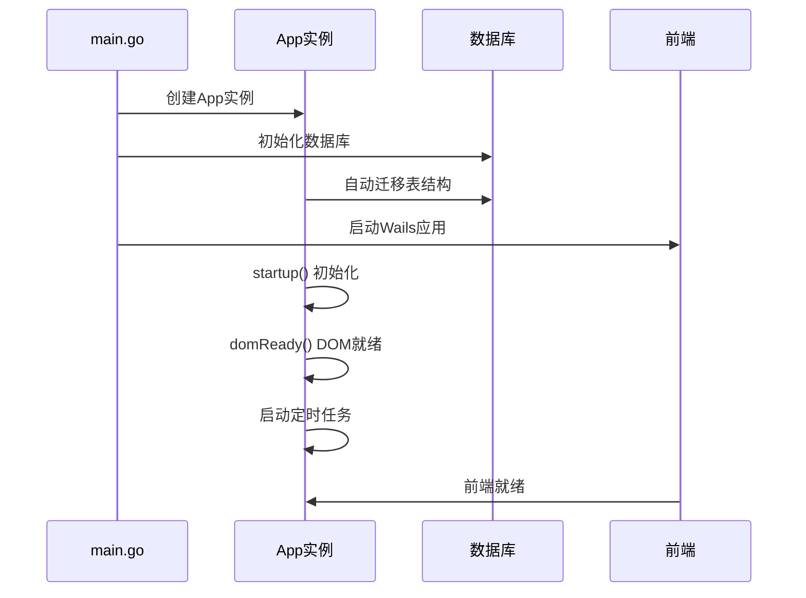
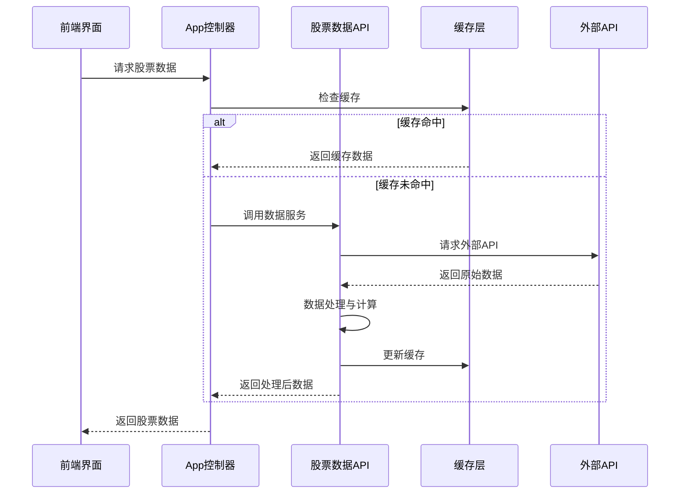
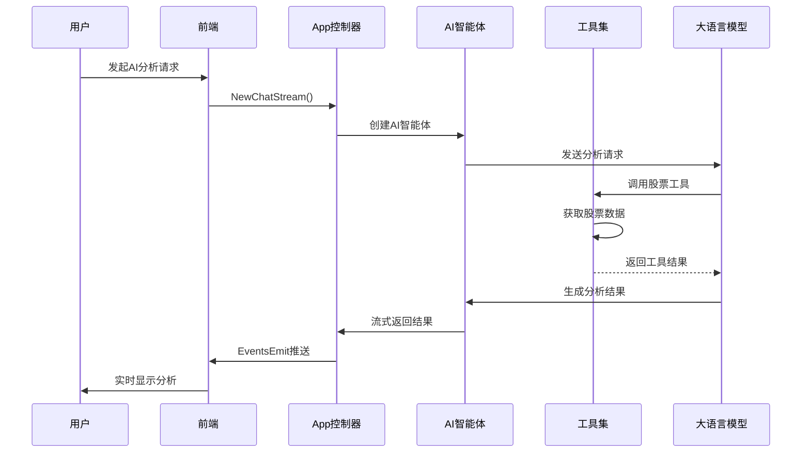
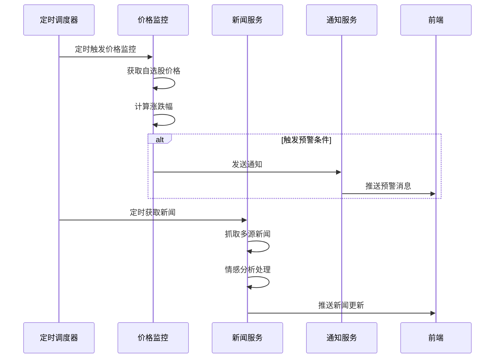
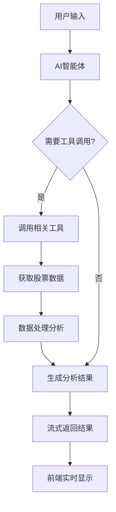

# go-stock : 基于大语言模型的AI赋能股票分析工具

## 


[](https://github.com/ArvinLovegood/go-stock)
[](https://gitee.com/arvinlovegood_admin/go-stock)

## 📋 目录

- [项目简介](#-项目简介)
- [系统架构](#-系统架构)
- [核心模块](#-核心模块)
- [技术栈](#-技术栈)
- [核心调用流程](#-核心调用流程)
- [配置部署](#-配置部署)
- [开发调试](#-开发调试)
- [API接口](#-api接口)
- [数据库设计](#-数据库设计)
- [AI集成](#-ai集成)
- [功能特性](#-功能特性)
- [更新日志](#-更新日志)
- [支持与赞助](#-支持与赞助)

## ✨ 项目简介

go-stock 是一个基于 **Wails** 框架和 **NaiveUI** 开发的现代化股票分析工具，深度集成多种AI大模型，为投资者提供智能化的股票分析服务。

### 核心特性
- 🤖 **AI智能分析**: 集成OpenAI、DeepSeek、Ollama等多种AI模型
- 📊 **多市场支持**: 支持A股、港股、美股实时数据
- 📈 **技术指标**: 完整的K线图表和技术指标分析
- 📰 **实时资讯**: 财联社、新浪财经等多源新闻聚合
- 🔔 **智能提醒**: 价格预警、涨跌提醒、钉钉通知
- 💼 **投资组合**: 自选股管理、成本核算、盈亏统计
- 🎯 **智能选股**: 基于自然语言的AI选股策略

### 🌟公众号


### 📈 交流群
- QQ交流群：[点击链接加入群聊【go-stock交流群】：491605333(定期清理，随缘入群)](http://qm.qq.com/cgi-bin/qm/qr?_wv=1027&k=0YQ8qD3exahsD4YLNhzQTWe5ssstWC89&authKey=usOMMRFtIQDC%2FYcatHYapcxQbJ7PwXPHK9OypTXWzNjAq%2FRVvQu9bj2lRgb%2BSZ3p&noverify=0&group_code=491605333)

## 🏗️ 系统架构

### 整体架构图

```
┌─────────────────────────────────────────────────────────────┐
│                    go-stock 系统架构                          │
├─────────────────────────────────────────────────────────────┤
│  前端层 (Frontend)                                           │
│  ┌─────────────────┐  ┌─────────────────┐  ┌──────────────┐ │
│  │   Vue 3 + Vite  │  │   NaiveUI       │  │  ECharts     │ │
│  │   组件化界面     │  │   UI组件库      │  │  图表可视化   │ │
│  └─────────────────┘  └─────────────────┘  └──────────────┘ │
├─────────────────────────────────────────────────────────────┤
│  桥接层 (Bridge)                                             │
│  ┌─────────────────────────────────────────────────────────┐ │
│  │              Wails Runtime                              │ │
│  │        Go ↔ JavaScript 双向通信                         │ │
│  └─────────────────────────────────────────────────────────┘ │
├─────────────────────────────────────────────────────────────┤
│  应用层 (Application)                                        │
│  ┌─────────────────┐  ┌─────────────────┐  ┌──────────────┐ │
│  │   App 主控制器   │  │   定时任务调度   │  │  事件管理器   │ │
│  │   业务逻辑协调   │  │   Cron Jobs     │  │  EventsEmit  │ │
│  └─────────────────┘  └─────────────────┘  └──────────────┘ │
├─────────────────────────────────────────────────────────────┤
│  服务层 (Services)                                           │
│  ┌─────────────────┐  ┌─────────────────┐  ┌──────────────┐ │
│  │   AI Agent      │  │   数据采集服务   │  │  通知服务     │ │
│  │   智能分析引擎   │  │   多源数据爬取   │  │  钉钉/系统    │ │
│  └─────────────────┘  └─────────────────┘  └──────────────┘ │
├─────────────────────────────────────────────────────────────┤
│  数据层 (Data)                                               │
│  ┌─────────────────┐  ┌─────────────────┐  ┌──────────────┐ │
│  │   SQLite 数据库  │  │   缓存层        │  │  配置管理     │ │
│  │   GORM ORM      │  │   FreeCache     │  │  Settings    │ │
│  └─────────────────┘  └─────────────────┘  └──────────────┘ │
├─────────────────────────────────────────────────────────────┤
│  外部接口层 (External APIs)                                   │
│  ┌─────────────────┐  ┌─────────────────┐  ┌──────────────┐ │
│  │   股票数据API    │  │   AI模型API     │  │  新闻资讯API  │ │
│  │   新浪/腾讯/Tushare│ │   OpenAI/DeepSeek│ │  财联社/新浪  │ │
│  └─────────────────┘  └─────────────────┘  └──────────────┘ │
└─────────────────────────────────────────────────────────────┘
```

### 技术架构特点

1. **跨平台桌面应用**: 基于Wails框架，支持Windows、macOS、Linux
2. **前后端分离**: Go后端 + Vue3前端，通过Wails Runtime通信
3. **模块化设计**: 清晰的分层架构，便于维护和扩展
4. **高性能**: SQLite数据库 + 内存缓存，响应迅速
5. **智能化**: 深度集成AI大模型，提供智能分析能力

## � 核心模块

### 1. 应用主控制器 (App)
**文件位置**: `app.go`, `main.go`

**核心职责**:
- 应用生命周期管理 (启动、关闭、更新)
- 前后端通信桥接
- 定时任务调度 (股价监控、新闻抓取)
- 系统配置管理
- 事件分发处理

**关键方法**:
```go
// 应用启动初始化
func (a *App) startup(ctx context.Context)

// DOM就绪后的初始化
func (a *App) domReady(ctx context.Context) 

// 股票价格监控
func MonitorStockPrices(a *App)

// 新闻推送处理
func (a *App) NewsPush(news *[]models.Telegraph)

// AI聊天流处理
func (a *App) NewChatStream(stock, stockCode, question string, aiConfigId int, sysPromptId *int, enableTools bool, think bool)
```

### 2. 数据服务层 (Data Layer)
**文件位置**: `backend/data/`

#### 2.1 股票数据API (`stock_data_api.go`)
- **实时行情获取**: 新浪财经、腾讯财经API集成
- **K线数据处理**: 日K、分时图数据
- **自选股管理**: 关注、取消关注、成本核算
- **技术指标计算**: MACD、RSI、KDJ等

#### 2.2 AI集成服务 (`openai_api.go`)
- **多模型支持**: OpenAI、DeepSeek、Ollama、火山方舟等
- **流式对话**: 实时AI分析结果推送
- **工具调用**: Function Calling集成
- **结果存储**: AI分析结果持久化

#### 2.3 新闻资讯服务 (`market_news_api.go`)
- **多源新闻聚合**: 财联社、新浪财经、TradingView
- **情感分析**: 新闻内容情感倾向分析
- **实时推送**: WebSocket实时新闻推送

#### 2.4 基金数据服务 (`fund_data_api.go`)
- **基金净值**: 实时净值、估值数据
- **基金筛选**: 基金搜索、关注管理

### 3. AI智能体 (Agent)
**文件位置**: `backend/agent/`

#### 3.1 智能体核心 (`agent.go`)
```go
func GetStockAiAgent(ctx *context.Context, aiConfig data.AIConfig) *react.Agent
```
- **ReAct模式**: 推理-行动循环
- **工具集成**: 多种股票分析工具
- **模型适配**: 支持多种AI模型

#### 3.2 工具集 (`backend/agent/tools/`)
- **股价查询工具**: `stock_price_info_tool.go`
- **K线数据工具**: `stock_k_line_data_tool.go`
- **新闻查询工具**: `market_news_tool.go`
- **经济数据工具**: `economic_data_tool.go`
- **选股工具**: `choice_stock_by_indicators_tool.go`

### 4. 数据持久化 (Database)
**文件位置**: `backend/db/db.go`, `backend/models/`

#### 4.1 数据库设计
- **SQLite**: 轻量级本地数据库
- **GORM**: Go ORM框架
- **读写分离**: 提高并发性能
- **连接池**: 优化数据库连接

#### 4.2 核心数据模型
```go
// 股票信息
type StockInfo struct {
    Code, Name, Price string
    ChangePercent, ChangePrice float64
    // ... 更多字段
}

// 自选股
type FollowedStock struct {
    StockCode, Name string
    CostPrice float64
    Volume int64
    // ... 更多字段
}

// AI分析结果
type AIResponseResult struct {
    StockCode, StockName string
    Content string
    ChatId string
    // ... 更多字段
}
```

### 5. 前端界面 (Frontend)
**文件位置**: `frontend/src/`

#### 5.1 技术栈
- **Vue 3**: 响应式前端框架
- **NaiveUI**: 现代化UI组件库
- **ECharts**: 专业图表库
- **Vite**: 快速构建工具

#### 5.2 核心组件
- **股票列表**: `components/stock.vue`
- **K线图表**: `components/KLineChart.vue`
- **AI聊天**: `components/agent-chat.vue`
- **市场资讯**: `components/market.vue`
- **设置面板**: `components/settings.vue`

## 🛠️ 技术栈

### 后端技术
| 技术 | 版本 | 用途 |
|------|------|------|
| **Go** | 1.25+ | 核心后端语言 |
| **Wails** | v2.11.0 | 跨平台桌面应用框架 |
| **GORM** | v1.31.1 | ORM数据库操作 |
| **SQLite** | - | 轻量级数据库 |
| **Resty** | v2.17.0 | HTTP客户端 |
| **Cron** | v3.0.1 | 定时任务调度 |
| **ChromeDP** | v0.14.2 | 浏览器自动化 |
| **FreeCache** | v1.2.4 | 内存缓存 |

### 前端技术
| 技术 | 版本 | 用途 |
|------|------|------|
| **Vue** | 3.5.17 | 前端框架 |
| **NaiveUI** | 2.43.2 | UI组件库 |
| **ECharts** | 5.6.0 | 图表可视化 |
| **Vite** | 7.2.4 | 构建工具 |
| **Vue Router** | 4.5.0 | 路由管理 |

### AI集成
| 平台/模型 | 状态 | 说明 |
|-----------|------|------|
| **OpenAI** | ✅ | GPT系列模型 |
| **DeepSeek** | ✅ | DeepSeek推理模型 |
| **Ollama** | ✅ | 本地大模型平台 |
| **火山方舟** | ✅ | 字节跳动AI平台 |
| **硅基流动** | ✅ | AI模型聚合平台 |
| **LMStudio** | ✅ | 本地模型运行 |

## 🔄 核心调用流程

### 1. 应用启动流程


### 2. 股票数据获取流程


### 3. AI分析流程


### 4. 定时任务流程


## 📦 立即体验
- 绿色版：[go-stock-windows-amd64.exe](https://github.com/ArvinLovegood/go-stock/releases)
- MACOS绿色版：[go-stock-darwin-universal](https://github.com/ArvinLovegood/go-stock/releases)


## ⚙️ 配置部署

### 系统要求
- **操作系统**: Windows 10+, macOS 10.15+, Linux (Ubuntu 18.04+)
- **内存**: 最低 4GB RAM，推荐 8GB+
- **存储**: 至少 500MB 可用空间
- **网络**: 稳定的互联网连接（用于数据获取和AI服务）

### 快速部署

#### 1. 直接运行（推荐）
```bash
# Windows
下载 go-stock-windows-amd64.exe
双击运行即可

# macOS
下载 go-stock-darwin-universal
chmod +x go-stock-darwin-universal
./go-stock-darwin-universal

# Linux
下载对应架构版本
chmod +x go-stock-linux-amd64
./go-stock-linux-amd64
```

#### 2. 从源码构建
```bash
# 1. 克隆项目
git clone https://github.com/ArvinLovegood/go-stock.git
cd go-stock

# 2. 安装依赖
go mod tidy
cd frontend && npm install

# 3. 安装Wails CLI
go install github.com/wailsapp/wails/v2/cmd/wails@latest

# 4. 构建应用
wails build

# 5. 运行
./build/bin/go-stock
```

### 核心配置

#### 1. AI模型配置
应用支持多种AI模型，需要在设置中配置：

```json
{
  "aiConfigs": [
    {
      "name": "OpenAI GPT-4",
      "baseUrl": "https://api.openai.com/v1",
      "apiKey": "your-openai-api-key",
      "modelName": "gpt-4",
      "maxTokens": 4000,
      "temperature": 0.7,
      "timeOut": 300
    },
    {
      "name": "DeepSeek",
      "baseUrl": "https://api.deepseek.com",
      "apiKey": "your-deepseek-api-key", 
      "modelName": "deepseek-chat",
      "maxTokens": 4000,
      "temperature": 0.7,
      "timeOut": 300
    }
  ]
}
```

#### 2. 数据源配置
```json
{
  "tushareToken": "your-tushare-token",
  "refreshInterval": 30,
  "updateBasicInfoOnStart": true,
  "crawlTimeOut": 60
}
```

#### 3. 通知配置
```json
{
  "localPushEnable": true,
  "dingPushEnable": false,
  "dingRobot": "your-dingtalk-webhook",
  "enablePushNews": true,
  "enableOnlyPushRedNews": false
}
```

### 数据目录结构
```
go-stock/
├── data/                    # 数据目录
│   ├── stock.db            # SQLite数据库
│   └── dict/               # 词典文件
├── logs/                   # 日志文件
│   └── wails.log
├── build/                  # 构建资源
│   ├── appicon.png
│   └── screenshot/
└── frontend/dist/          # 前端构建产物
```

## 🔧 开发调试

### 开发环境搭建

#### 1. 环境要求
- **Go**: 1.25+
- **Node.js**: 16+
- **Wails CLI**: 最新版本

#### 2. 开发模式启动
```bash
# 启动开发服务器
wails dev

# 或者分别启动前后端
# 后端
go run .

# 前端 (新终端)
cd frontend
npm run dev
```

#### 3. 调试配置

**VS Code调试配置** (`.vscode/launch.json`):
```json
{
  "version": "0.2.0",
  "configurations": [
    {
      "name": "Debug Go-Stock",
      "type": "go",
      "request": "launch",
      "mode": "debug",
      "program": "${workspaceFolder}",
      "env": {
        "CGO_ENABLED": "1"
      },
      "args": []
    }
  ]
}
```

#### 4. 构建脚本
```bash
# Windows构建
./scripts/build-windows.sh

# macOS构建  
./scripts/build-macos.sh

# 通用构建
./scripts/build.sh
```

### 代码结构说明

#### 后端目录结构
```
backend/
├── agent/                  # AI智能体
│   ├── agent.go           # 智能体核心
│   ├── tools/             # 工具集
│   └── tool_logger/       # 工具日志
├── data/                  # 数据服务层
│   ├── stock_data_api.go  # 股票数据API
│   ├── openai_api.go      # AI集成API
│   ├── market_news_api.go # 新闻资讯API
│   └── settings_api.go    # 配置管理API
├── db/                    # 数据库层
│   └── db.go             # 数据库初始化
├── models/                # 数据模型
│   └── models.go         # 核心数据结构
├── logger/                # 日志服务
│   └── lgo.go           # 日志配置
└── util/                  # 工具函数
    ├── html_to_markdown.go
    └── struct_to_markdown.go
```

#### 前端目录结构
```
frontend/src/
├── components/            # Vue组件
│   ├── stock.vue         # 股票列表
│   ├── agent-chat.vue    # AI聊天
│   ├── KLineChart.vue    # K线图表
│   ├── market.vue        # 市场资讯
│   └── settings.vue      # 设置面板
├── router/               # 路由配置
├── assets/               # 静态资源
├── App.vue              # 根组件
└── main.js              # 入口文件
```

## 📡 API接口

### 1. 股票数据接口

#### 获取实时股价
```go
func (a *App) Greet(stockCode string) *data.StockInfo
```
- **参数**: `stockCode` - 股票代码 (如: "sh600519")
- **返回**: 股票实时信息对象

#### 获取K线数据
```go
func (a *App) GetStockKLine(stockCode, stockName string, days int64) *[]data.KLineData
```
- **参数**: 
  - `stockCode` - 股票代码
  - `stockName` - 股票名称  
  - `days` - 获取天数
- **返回**: K线数据数组

#### 自选股管理
```go
// 添加自选股
func (a *App) Follow(stockCode string) string

// 移除自选股  
func (a *App) UnFollow(stockCode string) string

// 获取自选股列表
func (a *App) GetFollowList(groupId int) *[]data.FollowedStock
```

### 2. AI分析接口

#### 启动AI分析
```go
func (a *App) NewChatStream(stock, stockCode, question string, aiConfigId int, sysPromptId *int, enableTools bool, think bool)
```
- **参数**:
  - `stock` - 股票名称
  - `stockCode` - 股票代码
  - `question` - 分析问题
  - `aiConfigId` - AI配置ID
  - `enableTools` - 是否启用工具
  - `think` - 是否启用思考模式

#### 保存分析结果
```go
func (a *App) SaveAIResponseResult(stockCode, stockName, result, chatId, question string, aiConfigId int)
```

### 3. 新闻资讯接口

#### 获取新闻列表
```go
func (a *App) GetTelegraphList(source string) *[]*models.Telegraph
```

#### 新闻AI总结
```go
func (a *App) SummaryStockNews(question string, aiConfigId int, sysPromptId *int, enableTools bool, think bool)
```

### 4. 配置管理接口

#### 更新配置
```go
func (a *App) UpdateConfig(settingConfig *data.SettingConfig) string
```

#### 获取配置
```go
func (a *App) GetConfig() *data.SettingConfig
```

## 🗄️ 数据库设计

### 核心数据表

#### 1. 股票基础信息表 (stock_basics)
```sql
CREATE TABLE stock_basics (
    id INTEGER PRIMARY KEY,
    ts_code VARCHAR(20) UNIQUE,    -- 股票代码
    symbol VARCHAR(10),            -- 股票简称
    name VARCHAR(50),              -- 股票名称
    area VARCHAR(20),              -- 地区
    industry VARCHAR(50),          -- 行业
    market VARCHAR(20),            -- 市场类型
    list_date VARCHAR(20),         -- 上市日期
    created_at DATETIME,
    updated_at DATETIME
);
```

#### 2. 自选股表 (followed_stocks)
```sql
CREATE TABLE followed_stocks (
    id INTEGER PRIMARY KEY,
    stock_code VARCHAR(20),        -- 股票代码
    name VARCHAR(50),              -- 股票名称
    cost_price DECIMAL(10,3),      -- 成本价
    volume INTEGER,                -- 持仓数量
    price DECIMAL(10,3),           -- 当前价格
    alarm_change_percent DECIMAL(5,2), -- 预警涨跌幅
    alarm_price DECIMAL(10,3),     -- 预警价格
    sort INTEGER,                  -- 排序
    cron VARCHAR(50),              -- 定时分析表达式
    ai_config_id INTEGER,          -- AI配置ID
    created_at DATETIME,
    updated_at DATETIME
);
```

#### 3. AI分析结果表 (ai_response_results)
```sql
CREATE TABLE ai_response_results (
    id INTEGER PRIMARY KEY,
    stock_code VARCHAR(20),        -- 股票代码
    stock_name VARCHAR(50),        -- 股票名称
    content TEXT,                  -- 分析内容
    chat_id VARCHAR(100),          -- 对话ID
    question TEXT,                 -- 分析问题
    ai_config_id INTEGER,          -- AI配置ID
    created_at DATETIME,
    updated_at DATETIME
);
```

#### 4. 新闻资讯表 (telegraphs)
```sql
CREATE TABLE telegraphs (
    id INTEGER PRIMARY KEY,
    title VARCHAR(200),            -- 新闻标题
    content TEXT,                  -- 新闻内容
    source VARCHAR(50),            -- 新闻来源
    data_time DATETIME,            -- 新闻时间
    is_red BOOLEAN,                -- 是否重要新闻
    sentiment_result VARCHAR(20),   -- 情感分析结果
    created_at DATETIME,
    updated_at DATETIME
);
```

#### 5. 配置表 (settings)
```sql
CREATE TABLE settings (
    id INTEGER PRIMARY KEY,
    tushare_token VARCHAR(100),    -- Tushare Token
    refresh_interval INTEGER,      -- 刷新间隔
    local_push_enable BOOLEAN,     -- 本地通知
    ding_push_enable BOOLEAN,      -- 钉钉通知
    ding_robot VARCHAR(200),       -- 钉钉机器人
    dark_theme BOOLEAN,            -- 深色主题
    enable_news BOOLEAN,           -- 启用新闻
    enable_fund BOOLEAN,           -- 启用基金
    enable_agent BOOLEAN,          -- 启用AI智能体
    created_at DATETIME,
    updated_at DATETIME
);
```

#### 6. AI配置表 (ai_config)
```sql
CREATE TABLE ai_config (
    id INTEGER PRIMARY KEY,
    name VARCHAR(50),              -- 配置名称
    base_url VARCHAR(200),         -- API地址
    api_key VARCHAR(200),          -- API密钥
    model_name VARCHAR(50),        -- 模型名称
    max_tokens INTEGER,            -- 最大Token数
    temperature DECIMAL(3,2),      -- 温度参数
    time_out INTEGER,              -- 超时时间
    created_at DATETIME,
    updated_at DATETIME
);
```

### 数据库特性
- **SQLite**: 轻量级、无服务器、零配置
- **GORM**: 功能丰富的Go ORM库
- **读写分离**: 提高并发性能
- **连接池**: 优化数据库连接管理
- **自动迁移**: 应用启动时自动创建/更新表结构

## 🤖 AI集成

### 支持的AI平台

| 平台 | 状态 | 模型示例 | 配置说明 |
|------|------|----------|----------|
| **OpenAI** | ✅ | GPT-4, GPT-3.5-turbo | 标准OpenAI API格式 |
| **DeepSeek** | ✅ | deepseek-chat, deepseek-reasoner | 支持推理模式 |
| **Ollama** | ✅ | llama2, codellama, qwen | 本地部署模型 |
| **火山方舟** | ✅ | doubao-pro-4k | 字节跳动AI平台 |
| **硅基流动** | ✅ | Qwen, GLM, Baichuan | AI模型聚合平台 |
| **LMStudio** | ✅ | 本地模型 | 本地模型服务 |

### AI工具集成

#### 1. 股票分析工具
```go
// 股价查询工具
type ToolQueryStockPriceInfo struct{}

// K线数据工具  
type ToolGetStockKLine struct{}

// 选股工具
type ToolChoiceStockByIndicators struct{}

// 新闻查询工具
type ToolQueryMarketNews struct{}
```

#### 2. Function Calling
系统支持AI模型的Function Calling功能，AI可以主动调用以下工具：

- **SearchStockByIndicators**: 根据自然语言筛选股票
- **SearchBk**: 查询板块/概念数据
- **GetStockKLine**: 获取K线数据
- **InteractiveAnswer**: 获取投资者问答数据
- **GetStockResearchReport**: 获取研究报告
- **HotStockTable**: 获取热门股票排名

#### 3. AI分析流程


### AI配置示例

#### OpenAI配置
```json
{
  "name": "OpenAI GPT-4",
  "baseUrl": "https://api.openai.com/v1",
  "apiKey": "sk-xxx",
  "modelName": "gpt-4",
  "maxTokens": 4000,
  "temperature": 0.7,
  "timeOut": 300
}
```

#### DeepSeek配置
```json
{
  "name": "DeepSeek推理模型",
  "baseUrl": "https://api.deepseek.com",
  "apiKey": "sk-xxx",
  "modelName": "deepseek-reasoner",
  "maxTokens": 4000,
  "temperature": 0.7,
  "timeOut": 300
}
```

#### 本地Ollama配置
```json
{
  "name": "本地Qwen模型",
  "baseUrl": "http://localhost:11434/v1",
  "apiKey": "ollama",
  "modelName": "qwen:7b",
  "maxTokens": 2000,
  "temperature": 0.7,
  "timeOut": 300
}
```

## ✨ 功能特性

### 🎯 核心功能

#### 1. 智能股票分析
- **AI驱动分析**: 集成多种大语言模型，提供专业的股票分析
- **实时数据**: 支持A股、港股、美股实时行情数据
- **技术指标**: 完整的K线图表，支持MACD、RSI、KDJ等技术指标
- **情感分析**: 新闻资讯情感倾向分析，把握市场情绪

#### 2. 多市场支持
- **A股市场**: 沪深两市全覆盖，实时行情数据
- **港股市场**: 港交所股票数据，支持实时行情
- **美股市场**: 纳斯达克、纽交所股票数据
- **基金ETF**: 基金净值、估值数据（规划中）

#### 3. 智能选股系统
- **自然语言选股**: 通过自然语言描述选股条件
- **AI推荐**: 基于市场数据和AI分析的股票推荐
- **策略回测**: 选股策略的历史表现分析
- **风险评估**: 投资风险提示和建议

#### 4. 实时资讯聚合
- **多源新闻**: 财联社、新浪财经、TradingView等
- **智能推送**: 根据关注股票智能推送相关新闻
- **AI总结**: 新闻内容AI智能总结和分析
- **情感标记**: 新闻情感倾向自动标记

#### 5. 投资组合管理
- **自选股管理**: 添加、删除、分组管理自选股
- **成本核算**: 持仓成本、盈亏计算
- **预警系统**: 价格预警、涨跌幅预警
- **收益统计**: 投资收益统计和分析

### 🔧 高级功能

#### 1. AI智能体
- **多轮对话**: 支持连续对话，深入分析
- **工具调用**: AI主动调用股票分析工具
- **思考模式**: DeepSeek推理模式，深度思考
- **结果保存**: 分析结果自动保存，支持导出

#### 2. 定时任务
- **自动分析**: 定时自动分析关注股票
- **价格监控**: 实时监控股价变化
- **新闻抓取**: 定时抓取最新市场资讯
- **数据更新**: 自动更新股票基础数据

#### 3. 通知系统
- **本地通知**: 系统原生通知
- **钉钉通知**: 钉钉机器人消息推送
- **预警提醒**: 价格预警、重要新闻提醒
- **智能过滤**: 根据重要性智能过滤通知

#### 4. 数据可视化
- **K线图表**: 专业的股票K线图表
- **技术指标**: 多种技术指标图表
- **资金流向**: 主力资金流向分析
- **行业热图**: 行业板块热力图

### 🎨 用户体验

#### 1. 现代化界面
- **响应式设计**: 适配不同屏幕尺寸
- **深色主题**: 支持深色/浅色主题切换
- **流畅动画**: 丰富的交互动画效果
- **直观操作**: 简洁直观的用户界面

#### 2. 性能优化
- **内存缓存**: 高效的内存缓存机制
- **异步处理**: 异步数据加载，不阻塞界面
- **增量更新**: 增量数据更新，减少网络请求
- **资源优化**: 优化资源加载，提升启动速度

#### 3. 跨平台支持
- **Windows**: 完整功能支持
- **macOS**: 原生macOS体验
- **Linux**: 基础功能支持
- **自动更新**: 支持应用自动更新

## 🧩 重大功能开发计划
| 功能说明            | 状态 | 备注                                                                                                       |
|-----------------|----|----------------------------------------------------------------------------------------------------------|
| 股票分析知识库         | 🚧 | 未来计划                                                                                                     |
| Ai智能选股          | ✅ | Ai智能选股功能(市场行情-》AI总结/AI智能体功能)                                                                             |
| ETF支持           | 🚧 | ETF数据支持 (目前可以查看净值和估值)                                                                                    |
| 美股支持            | ✅  | 美股数据支持                                                                                                   |
| 港股支持            | ✅  | 港股数据支持                                                                                                   |
| 多轮对话            | ✅  | AI分析后可继续对话提问                                                                                             |
| 自定义AI分析提问模板     | ✅  | 可配置的提问模板 [v2025.2.12.7-alpha](https://github.com/ArvinLovegood/go-stock/releases/tag/v2025.2.12.7-alpha) |
| 不再强制依赖Chrome浏览器 | ✅  | 默认使用edge浏览器抓取新闻资讯                                                                                        |

## 👀 更新日志

### 最新版本特性
- **2025.12.16**: 新增AI思考模式与热门选股策略功能
- **2025.11.21**: 新增带频率权重的情感分析功能
- **2025.10.30**: 添加AI智能体功能开关，移除页面水印
- **2025.09.27**: 添加机构/券商的研究报告AI工具函数
- **2025.08.09**: 添加AI智能体聊天功能

### 重要更新历史

#### 2025年重大更新
- **07.08**: 实现软件自动更新功能
- **07.07**: 卡片添加迷你分时图
- **07.05**: MacOs支持
- **07.01**: AI分析集成工具函数，AI分析更加智能
- **06.30**: 添加指标选股功能
- **06.27**: 添加财经日历和重大事件时间轴功能
- **06.25**: 添加热门股票、事件和话题功能
- **06.18**: 更新内置股票基础数据，软件内实时市场资讯信息提醒
- **06.15**: 添加公司公告信息搜索/查看功能，个股研报功能
- **06.12**: 添加龙虎榜功能，新增行业排名分类

#### 核心功能完善
- **05.30**: 优化股票分时图显示
- **05.20**: 修复财联社电报获取问题
- **05.16**: 优化资金趋势图表组件
- **05.15**: 重构应用加载和数据初始化逻辑
- **05.14**: 添加个股资金流向功能
- **05.13**: 添加行业排名功能
- **05.09**: 添加A股盘口数据解析和展示功能

#### 多市场支持
- **04.29**: 补全港股/美股基础数据，优化港股股价延迟问题
- **04.25**: 市场资讯支持AI分析和总结
- **04.24**: 新增市场行情模块
- **04.22**: 优化K线图展示，支持拉伸放大
- **04.21**: 港股，美股K线数据获取优化

#### AI功能增强
- **03.29**: 多提示词模板管理
- **03.28**: AI分析结果保存为markdown文件
- **02.28**: 美股数据支持
- **02.23**: 弹幕功能
- **02.22**: 港股数据支持
- **02.16**: AI分析后可继续对话提问
- **02.12**: 可配置的提问模板

### 版本发布节点
- **v2025.2.16.1-alpha**: AI多轮对话功能
- **v2025.2.12.7-alpha**: 可配置提问模板

## 🦄 重大更新展示

### AI情感分析功能


### 市场资讯AI分析


### 市场行情模块


### AI股票分析


## 📸 功能截图

### 主界面


### 设置面板


### 成本设置


### 日K线图


### 分时图


### 钉钉报警通知


### 版本信息


## 💕 感谢以下项目
- [NaiveUI](https://www.naiveui.com/) - 现代化Vue UI组件库
- [Wails](https://wails.io/) - 跨平台桌面应用框架
- [Vue](https://vuejs.org/) - 渐进式JavaScript框架
- [Vite](https://vitejs.dev/) - 下一代前端构建工具
- [Tushare](https://tushare.pro/register?reg=701944) - 金融数据接口

## 🎯 支持与赞助

### <span style="color: #568DF4;">如果这个项目对您有帮助，请给我一个<i style="color: #EA2626;">star</i>吧！</span>💕

### 推荐服务商
- **火山方舟**: 新用户每个模型注册即送50万tokens，[注册链接](https://www.volcengine.com/experience/ark?utm_term=202502dsinvite&ac=DSASUQY5&rc=IJSE43PZ)
- **硅基流动**: 注册即送2000万Tokens，[注册链接](https://cloud.siliconflow.cn/i/foufCerk)
- **Tushare**: 免费提供各类金融数据，[注册链接](https://tushare.pro/register?reg=701944)

### 支持开源计划
| 赞助计划 | 赞助等级 | 权益说明 |
|:---------|:---------|:---------|
| 每月 0 RMB | vip0 | 🌟 全部功能，软件自动更新(从GitHub下载) |
| 每月赞助 18.8 RMB<br>每年赞助 120 RMB | vip1 | 💕 全部功能，软件自动更新(从CDN下载)，AI配置指导 |
| 每月赞助 28.8 RMB<br>每年赞助 240 RMB | vip2 | 💕💕 vip1全部功能，启动时自动同步最近24小时市场资讯 |
| 每月赞助 X RMB | vipX | 🧩 更多计划，视项目发展情况而定 |

### 😘 赞助我
#### 如果我的项目对您有帮助，请赞助我吧！😊😊😊
| 支付宝 | 微信 |
|--------|------|
|  |  |

### 🐳 技术支持申明
- 本软件基于开源技术构建，使用Wails、NaiveUI、Vue、AI大模型等开源项目
- 技术问题可先向对应的开源社区请求帮助
- 开源不易，本人精力和时间有限，如需一对一技术支持，请先赞助

| 技术支持方式 | 赞助(元) |
|:-------------|:--------:|
| 加 QQ：506808970 | 100/次 |
| 长期技术支持（不限次数，新功能优先体验等） | 5000 |

## ⭐ Star History
[](https://star-history.com/#ArvinLovegood/go-stock&Date)

## 🤖 状态


## 📄 License
[Apache License 2.0](LICENSE)

---

**免责声明**: 本软件仅供学习研究使用，不构成投资建议。投资有风险，入市需谨慎。使用本软件进行投资决策的风险由用户自行承担。

